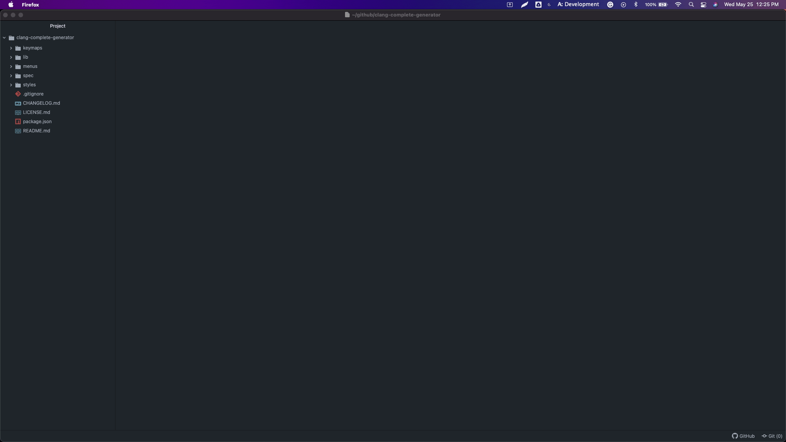

# .clang_complete Generator Package (clang-complete-generator)

This package generates a .clang_complete file at your project's root folder. The .clang_complete file is used by some other packages like Autocomplete Clang to know where to look for the source files and be able to use the go-to functionality (F3 by default)

## How to use
Use either of the following options
- Click on Packages -> Generate clang_complete -> Generate
- Press CTRL + ALT + G to generate the .clang_complete file.

You will see it appear at your project's root folder

Note: I have only tested this in MAC. It might work with Windows and Linux but not warranties.
